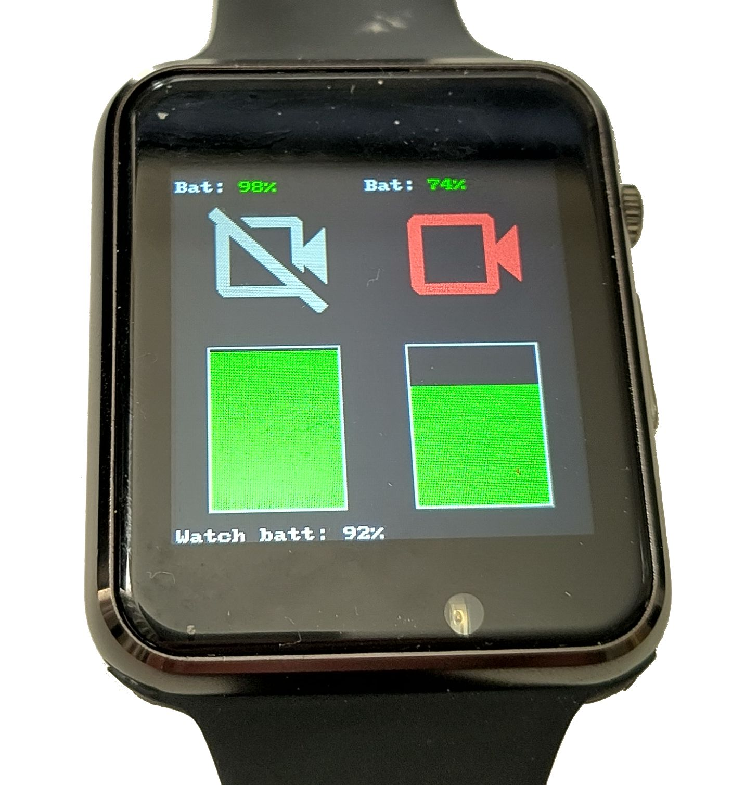

# T-Watch-2020 Camera Remote
*formerly camerawatch whilst I was developing it*



## Introduction

Use a [LilyGo T-Watch 2020 V3](https://lilygo.cc/products/t-watch-2020-v3) to monitor and control a TomTom Bandit and/or GoPro action camera. Note: this is _not_ compatible with the [T-Watch S3](https://lilygo.cc/products/t-watch-s3), I did try to get it working there for a bit before giving up because there are too many changes given that I already had something working here.

My personal use is for riding my bike. I have a GoPro on my helmet, and a Bandit mounted to the back of my bike, facing backwards. The Bandit has a tendency to complain about SD card errors and stop recording, which is less than useful when it's mounted on the back of my bike where I might not hear it and definitely can't easily restart recording, and the GoPro has a battery life that won't last an entire moderate length ride with my settings. This project helps with both of these problems, by showing me the recording and battery status of the cameras, and letting me start and stop recording, with a vibration alert when the Bandit stops recording.

## Installation

### Firmware

This project uses MicroPython with [the st7789_mpy driver](https://github.com/russhughes/st7789_mpy) built in. This does mean that a stock MicroPython image won't work, because it won't be able to display anything to the screen. You have two options here; either build it yourself, or use whatever random version I've built.

For whatever random version I've built, that should be available from the GitHub releases page (see the section at the end of this page for licensing information).

For building it yourself, here are the basic instructions:

 * Clone this repo, [micropython](https://github.com/micropython/micropython), and [st7789_mpy](https://github.com/russhughes/st7789_mpy) to the same parent directory (to have, for example, `git/micropython`, `git/st7789_mpy`, and `git/t-watch-2020-camera-remote`)
 * Go about setting up a build environment for MicroPython. Pay attention to what version of the ESP-IDF is actually supported by MicroPython, as I ran into issues quite a few times by using one that was too new.
 * `cd` into `ports/esp32` in the micropython repository 
 * Optionally, for better display performance, modify `spi_device_interface_config_t`'s `.flags` to add `| SPI_DEVICE_NO_DUMMY` to the end, in `machine_hw_spi.c`
 * Build the firmware with the following command
```
make USER_C_MODULES=../../../../st7789_mpy/st7789/micropython.cmake BOARD_VARIANT=SPIRAM FROZEN_MANIFEST=../../../../../../t-watch-2020-camera-remote/frozen_manifest.py
```
 * Install as per instructions from the build output

### Software

Once you have the firmware up and running, copy all of the `*.py` files and the `res` directory from this repo onto the device, e.g.:

```
mpremote cp *.py :
mpremote cp -r res :
```

You will also need to create and copy over a file called `config.json` - an example is provided, which is pretty much the configuration I run with just with the values for connecting to the cameras changed.

Once you've done this, you should be able to restart the watch and it will all come up.

Note that `frozen_manifest.py` is only used when building MicroPython, not in the watch itself, so delete that if you're running out of space on the watch, it's just easier to copy over all `.py` files than all but one of them.

## Usage

There are two modes that the code can come up in - charging mode and active mode. Charging mode just shows the battery level of the watch, or a disconnected symbol if it's not plugged in. Pressing the button on the side of the watch will restart the watch; if it's plugged in, that will just put it back into charging mode, if it *isn't* plugged in then it will boot into the active mode.

In active mode, you should have two vertically-split panes, with one camera on each pane. There is a textual representation of the battery level at the top, then an icon indicating the current state of the camera/connection to the camera, then the battery level as a bar chart. At the very bottom there is also a textual representation of the watch's battery.

Interacting with the watch is fairly simple:
  * Tapping the status icon for a camera that isn't connected initiates a connection
  * Tapping the status icon for a camera that is connected but not recording tells it to start recording
  * Pressing and holding the status icon for a camera that is connected and recording tells it to stop recording
  * Pressing the side button tells the camera configured under "button_press_start" to start recording
  * As built-in to the hardware, pressing and holding the side button turns it off. This does have the unfortunate effect of first triggering a recording, so I recommend turning off the camera first

Additionally, the watch will vibrate at you if:
  * You have a camera configured with "notify_on_stop"
  * The camera has been recording at some point since the watch connected to it
  * The camera stops recording except due to you having triggered it via the watch

I would like to have some alternate way to dismiss this notification other than just restarting the watch or restarting recording, but I can't think of a good UX for doing that.

Theoretically it could also work if you have both cameras configured to notify you, but it would probably get a bit confusing and I haven't tested it.

Additionally, a log is written to `watch.log` on the watch. The default log level is `INFO`.

## Extending

It should be relatively straightforward to add other devices to this - take a look at Camera.py for the class to inherit from, and the functions that are used by the code.

## Other Notes

I had this working on a V1 watch, but some configuration changes were needed to make it work with the V3. I think there were just some pins modified, nothing too complex. As mentioned at the top of the README, the S3 is a very different watch in several ways, and so some effort would have to go in to making it run on that.

The watch seems to have two choices of strap; really fiddly and annoying, or the big clear one that is easy to use but that eventually kills the watch by letting water in/not letting water and sweat escape. I wish I had a solution to this. I was considering designing 3D prints to plug the big holes that are left open when using the clear strap, but I think the overall design of the strap makes it unsuitable for use with exercise and/or outdoors.

## To Do

* Figure out why unplugging on the charging screen is restarting the watch (I suspect it might be a false trigger of the button)
* Once I've figured out the above, make the charging screen go away if unplugged for X amount of time
* Report on the reason *why* there was a status change, if possible (e.g. overheating, full SD card)
* Show more information about the current status of the camera (e.g. free space, recording mode/profile)
* Figure out a good way to dismiss the vibration notification without restarting the watch
* Reverse engineer the Bluetooth/BLE connection to the Bandit, as used by the official remote, for hopefully better battery life, but possibly at the expense of functionality

## Other Licences

These are applicable for the prebuilt firmware I've made available: [MicroPython](documentation/LICENSE.micropython), and [st7789_mpy](documentation/LICENSE.st7789_mpy). This repository's licence is available in [the LICENSE file](LICENSE).

Icons used are modified from [Google Fonts Material Symbols and Icons](https://fonts.google.com/icons), which are released under [the Apache 2.0 licence](documentation/LICENSE.icons).
